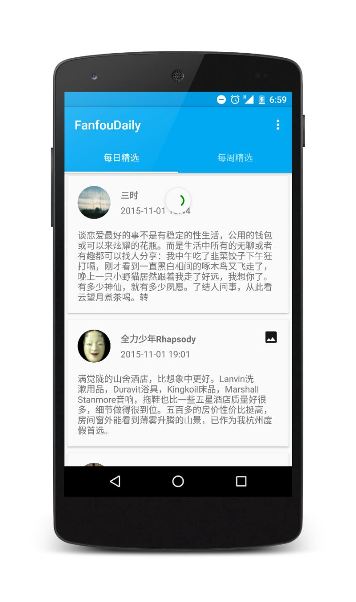
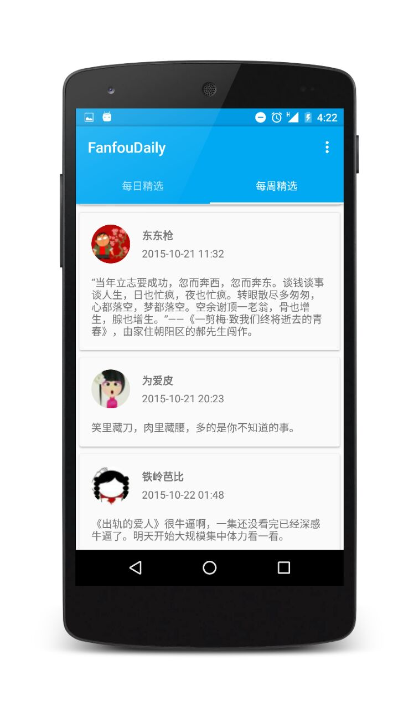
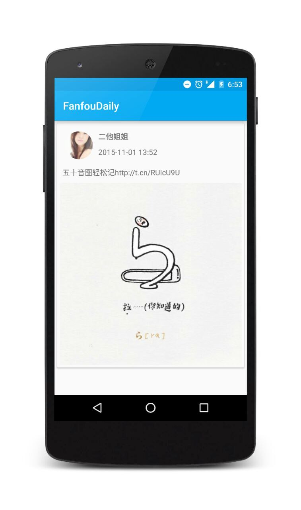

## 饭否精选 第三方客户端 for Android

「饭否精选」是我的一个小练习。RecyclerView + Volley. 另外使用的一些第三方库有 Butterknife 和 CircleView 等。

T^T 讲真我觉得我还是要再努力学习。


Still under building.

### Screenshot






### 已完成：
- 可以从 Api 接口中解析数据并完整呈现
- 可以在「每日精选」和「每周精选」间切换


### To do:
- Feed 中的超链接呈现 :beers:
- 下拉刷新 :beers:
- 在解析 Api 之前先解析得到全部可以使用的 api 地址，从中挑选出 weekly 和 daily
- 将 Api 地址放进 Database 中，下拉刷新时先对比 Database 中的 Api 地址是否已 update
- 全面使用 butterknife 精简代码 :beers:
- 复用 FragmentDaily 和 FragmentWeekly，精简代码
- 支持饭否帐号登录，增加收藏功能
- 点击 Feed 后能够进入 FragmentDetail :beers: 没有增加 `Fragment`，直接用了一个简单的`UIStatus` 实现比较容易XD
- `Hometimeline` 中隐藏了图片，如果当前 feed 有图，右上角有 label 标明，点击后进入`UIStatus` 中查看图 :beers:
- 自定义 `TextView` 中 Feed 的 CSS 樣式 
- 自定义字体
- 嘗試增加 `animation`


## Some thing I would like to write it here:
- 很感谢 [rex](https://github.com/zhasm) 提供的 Api，才使得这个小项目成为可能。


## License

```
Copyright 2015 Google, Inc.

Licensed to the Apache Software Foundation (ASF) under one or more contributor
license agreements. See the NOTICE file distributed with this work for
additional information regarding copyright ownership. The ASF licenses this
file to you under the Apache License, Version 2.0 (the "License"); you may not
use this file except in compliance with the License. You may obtain a copy of
the License at

http://www.apache.org/licenses/LICENSE-2.0

Unless required by applicable law or agreed to in writing, software
distributed under the License is distributed on an "AS IS" BASIS, WITHOUT
WARRANTIES OR CONDITIONS OF ANY KIND, either express or implied. See the
License for the specific language governing permissions and limitations under
the License.
```

