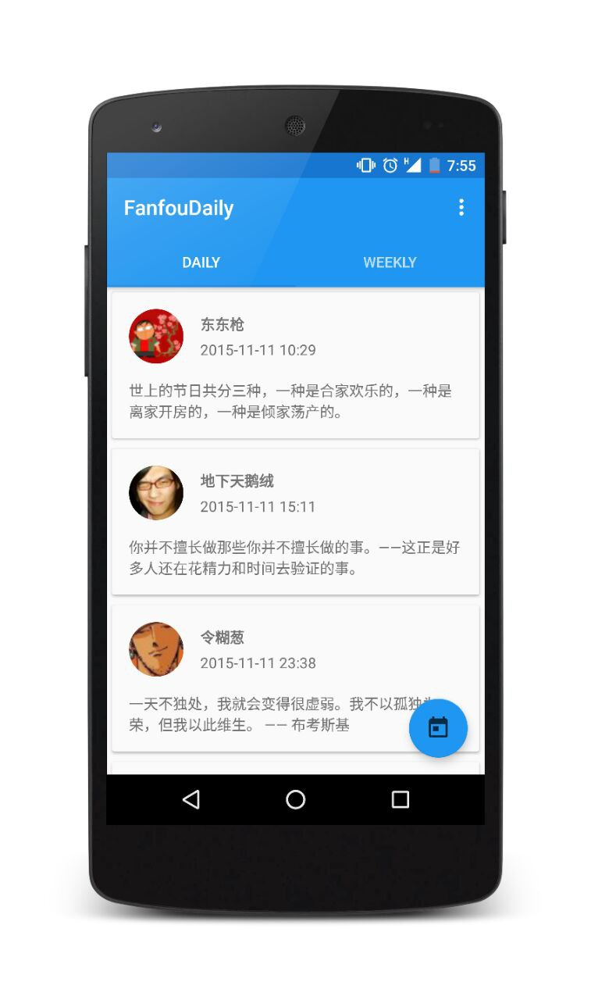

## 饭否精选 第三方客户端 for Android —— 饭否 Daily


「饭否精选」是我的一个小练习。RecyclerView + Volley. 另外使用的一些第三方库有 `Butterknife` , `EventBus`, `CircleView` 等。


<del> Still under building. </del>

Almost there ;)

### Screenshot




### 已完成：
- 可以从 Api 接口中解析数据并完整呈现
- 可以在「每日精选」和「每周精选」间切换
- 可以查看 `2015-10-05` 开始的任意时间的 `每日精选`，以及最新一期的`每周精选`

### TO DO
- 增加卡片的点击事件
- 实现饭否帐号登录，实现「收藏」「转发」等功能
- 实现转发到其他平台
- 夜间模式
- 「每周精选」的 `Fragment` 底部增加 footer，浏览到最底部后可以自动加载上一期「每周精选」
- 考虑增加这个[工具](https://github.com/mcxiaoke/gradle-packer-plugin)，用以管理多渠道打包和版本号
- 多语言支持

### Installation
<del>Still trying to figure out the publishing method.</del>

<del>And currently only support</del> 

- Build from source code(using Android Studio).
- [GitHub release](https://github.com/Anthonyeef/FanfouDaily/releases/download/v0.9.2/app-github-release.apk)
- [Fir](http://fir.im/zhj3)
- Scan QR code:


## Some thing I would like to write it here:
- 很感谢 [rex](https://github.com/zhasm) 提供的 Api，才使得这个小项目成为可能。

## Q&A
- 为什么 icon 中的 Daily 少了一个 y？

	因为这是用 Android Asset Studio 在线生成的 icon。本来想是「饭否精选」的，但发现文字部分过长会被截掉。换成英文，于是 y 就被截掉了……但看着也蛮舒服的。等有时间会尝试画一个 icon 出来 :)
	
- 为什么右上角的菜单只有一个设置，而且点击后没有反应？

	抱歉……因为临近考试，所以右上角的 popup menu 部分还没有写。后面的版本会加上内容，以及夜间模式 :)

- 为什么只有每日精选可以选择日期，每周精选不可以？

	因为每日精选是从 `2015-10-05` 后每天都有的，故很方便可以在 `DatePickerDialog` 里通过选择日期来选择期数。但每周精选是每周的周一上午 8 点才会有一期，如果也用一个 `DatePickerDialog` 来挑选，大大的日历只有星期一可以选，感觉不是很好 :( 后面会通过「下拉到底部自动加载上一期每周精选」的方式来呈现内容；或者是其他更优雅的解决方法。
	
- 你是谁？
	- 我的 [blog](https://anthonyeef.github.io)
	- 我的 [diary](https://anthonyeef.github.io/diary)
	- 我的[饭否](http://fanfou.com/anthonyeef)
	
## License

```
DO WHAT THE FUCK YOU WANT TO PUBLIC LICENSE
                   Version 2, December 2004
 
Copyright (C) 2019 Yifen Wu <anthonyeef@gmail.com>

Everyone is permitted to copy and distribute verbatim or modified
copies of this license document, and changing it is allowed as long
as the name is changed.
 
           DO WHAT THE FUCK YOU WANT TO PUBLIC LICENSE
  TERMS AND CONDITIONS FOR COPYING, DISTRIBUTION AND MODIFICATION

 0. You just DO WHAT THE FUCK YOU WANT TO.
 ```

